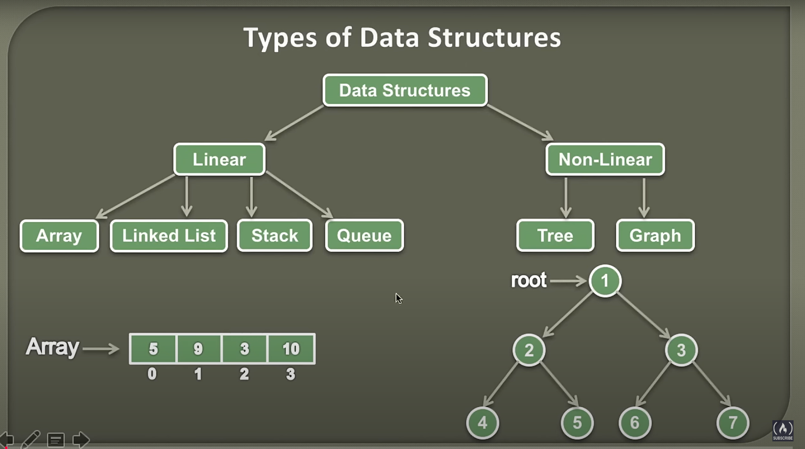

## Type of Data Structures

## Algorithms
Time Complexity (độ phức tạp thời gian) trong giải thuật là một khái niệm dùng để đo lường hiệu suất của một thuật toán, cụ thể là lượng thời gian mà thuật toán cần để chạy, khi kích thước của đầu vào tăng lên.

Ý nghĩa của Time Complexity:
- Định lượng hiệu suất: Time Complexity giúp đánh giá thuật toán nào sẽ hoạt động tốt hơn trong trường hợp dữ liệu lớn.
- Phụ thuộc vào kích thước đầu vào: Thời gian thực thi của thuật toán thường phụ thuộc vào số lượng phần tử trong đầu vào, được ký hiệu là 𝑛.

Biểu diễn Time Complexity:
Time Complexity thường được biểu diễn bằng ký hiệu Big-O ( 𝑂 O), ví dụ:
- O(1): Thời gian không thay đổi, bất kể kích thước đầu vào.
- O(logn): Tăng theo logarithm của kích thước đầu vào (ví dụ: thuật toán tìm kiếm nhị phân).
- O(n): Tăng tuyến tính theo kích thước đầu vào (ví dụ: duyệt mảng).
- O(nlogn): Thời gian tăng nhanh hơn tuyến tính nhưng ít hơn bình phương (ví dụ: thuật toán sắp xếp hiệu quả như Merge Sort).
- O(n2): Tăng theo bình phương kích thước đầu vào (ví dụ: Bubble Sort hoặc duyệt hai vòng lặp lồng nhau).
- O(2n): Thời gian tăng theo cấp số nhân (ví dụ: thuật toán quay lui hoặc đệ quy với nhiều nhánh).
- O(n!): Thời gian tăng cực kỳ nhanh (ví dụ: giải bài toán hoán vị).